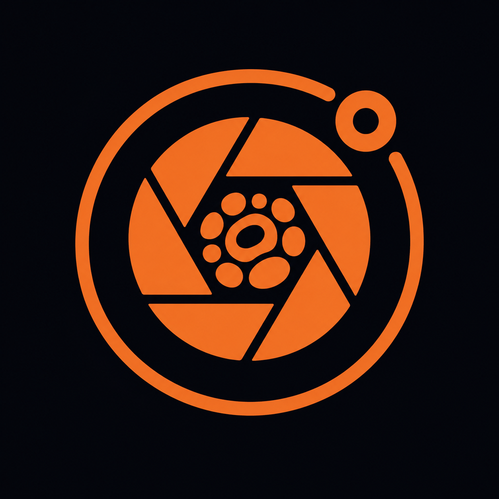
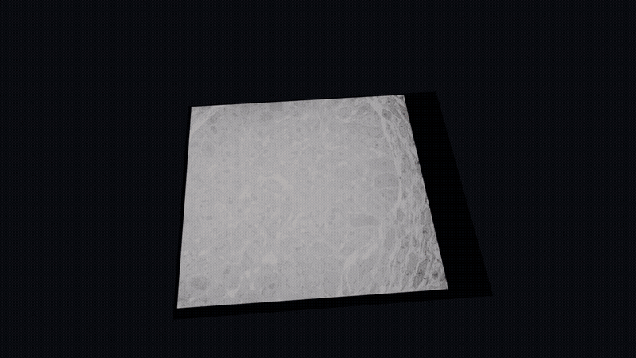
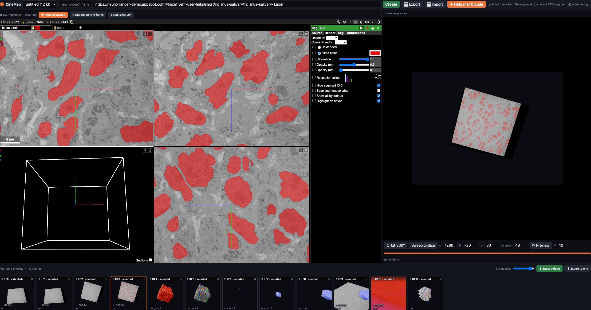
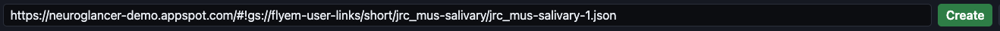
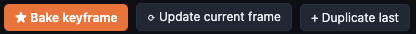
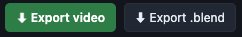

<p align="center"></p>

<h1 align="center">CineMap</h1>

<p align="center"><b>Cinematic videos from large-scale EM segmentation data.</b><br>
Scout in Neuroglancer, render in Blender.</p>

<p align="center"></p>
<p align="center"><sub><i>An example shot rendered with CineMap.</i></sub></p>



---

## How it works

CineMap turns Neuroglancer views into a keyframe timeline that Blender renders
into a smooth video.

**Neuroglancer is not the renderer — it is your control surface.** You arrange
the scene exactly how you want it in Neuroglancer (and frame it in the 3D
preview), then capture it as a keyframe. Blender generates the actual frames.

## Quick start

**1. Paste your Neuroglancer state link into the field and click `Create`.**



**2. Scout freely in the Neuroglancer pane** — choose layers, segments, colors,
whatever you want to show.

**3. Capture the view.** Click `★ Bake keyframe` to save the current view as a new
keyframe, or `⟳ Update current frame` to overwrite the selected one. Each keyframe
becomes one Blender frame.



## What a keyframe captures

Baking (or updating) a keyframe records the full state of your view:

- **Visible layers** — which Neuroglancer layers are shown
- **Visible segments** — for mesh layers, which segment IDs are on
- **Segment colors** — the exact colors from Neuroglancer
- **3D mesh opacity & silhouette** — the mesh rendering style
- **3D background** — Neuroglancer's projection-view background color (per keyframe,
  so it can change through a shot); when you change it in Neuroglancer and
  `⟳ Update current frame`, CineMap offers to propagate it to the other keyframes
- **Camera** — position, zoom, and rotation, taken from the **3D preview** panel

To frame a shot, use the **3D preview** (right pane): zoom in, zoom out, and rotate
there — that camera is what gets baked.

## Working with the timeline

- **Preview the motion** — click `▷ Preview` to see the interpolated animation
  between your keyframes.
- **Update a frame** — select a keyframe and `⟳ Update current frame` to replace it
  with your latest view.
- **Copy / paste frames** — select a keyframe, then use the copy/paste buttons or
  `Ctrl-C` / `Ctrl-V` to duplicate its camera and layer state.
- **Reorder frames** — drag keyframes along the timeline to change their order.
- **Add plane sweeps** — EM slice sweeps and mesh cutaways live in the lower sweep
  lane, independent of camera keyframes; disable a sweep to keep it on the timeline
  but out of preview/export renders.
- **Import / Export project** — save and reload a whole project with `⭱ Import` /
  `⭳ Export`.

## Render controls

The toolbar above the preview is grouped into labeled rows:

- **movie** — output `w`/`h`/`fps` and the `▷ Preview` action.
- **render** — `engine` (Cycles photoreal vs. Eevee fast), `⚡ fast`, and `samples`
  (render cleanliness — *not* mesh resolution).
- **mesh** — `detail` (per-layer vertex budget — mesh *resolution*), `lod`
  (adaptive / single / per-chunk), and **`from labels`**: build meshes from the
  label voxels with zmesh instead of downloading precomputed Neuroglancer meshes.
  When `from labels` is on, two extra knobs apply:
    - **smooth** — Taubin smoothing passes (rounds off the voxel staircase).
    - **decimate** — keep this fraction of the faces after meshing (e.g. *medium* ≈
      50%, *extreme* ≈ 10%), so the delivered mesh sits below the detail budget with
      less VRAM. Decimation is per segment, so instance colors are preserved.

  Label meshing loads up to the `detail` budget, then decimates below it. Large,
  sparsely-occupied regions (e.g. thousands of scattered organelles) are read and
  meshed **blockwise** automatically — bounded per-block memory so a fine scale that
  wouldn't fit in one read still works.
- **scene** — `director`, the bounding-box wireframe (`bbox` + color + source).

## Exporting

- `⬇ Export video` — render the full shot to an mp4.
- `⬇ Export .blend` — a self-contained Blender file (camera, meshes, EM slices,
  packed textures) for manual finishing.
- `⟳ Render all` fills keyframe thumbnails and sweep preview strips; full exports
  still render enabled slices and cutaways from the timeline.



## Run locally

```bash
mamba create -y -n mv_env python=3.11
conda run -n mv_env pip install -e .     # installs all deps incl. bpy (Blender/Cycles)
./run.sh                                 # -> http://0.0.0.0:8000
```

Requires an NVIDIA GPU (OPTIX / Cycles) and network access to the data host (data
is read over https; `/nrs` need not be mounted).

Projects and render assets are stored under `./projects/` by default. Set
`CINEMAP_PROJECTS_DIR` to use shared storage or another project root.

**Choosing a GPU.** By default the renderer uses every available NVIDIA GPU. On a
multi-GPU machine, set `CINEMAP_GPU` to pick one (or several) by index — the
render log prints `OPTIX GPUs available: [0:…, 1:…]` so you know the indices:

```bash
CINEMAP_GPU=1   ./run.sh      # render only on GPU 1
CINEMAP_GPU=0,2 ./run.sh      # render on GPUs 0 and 2
```

## Let Claude help

Click `✦ Help me! Claude` to open the director panel and just ask in plain
language — *"orbit the nuclei, then sweep a z-slice"*. Claude builds the
keyframes for you.


Everything Claude creates is normal keyframes, so you stay in control — **tweak,
reframe, reorder, or re-bake any of them afterward** exactly as if you'd made them
by hand. (Requires `ANTHROPIC_API_KEY`.)
